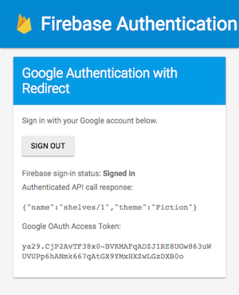

# Google Cloud Endpoints Firebase Javascript Client

Please see `makeEndpointsRequest()` in `google-redirect.html` for how to make a
request to an API managed by Google Cloud Endpoints.

## Set up your project on the [Firebase Console](https://console.firebase.google.com)

To add Firebase to your app, you'll need a Firebase project and a short snippet of code to add to your application HTML that has a few details about your project.

- Create a Firebase project in the Firebase console, if you don't
  already have one.  If you already have an existing Google project
  associated with your app, click Import Google Project. Otherwise,
  click Create New Project.

- Enable Google in the Auth section  > SIGN IN METHOD tab > Sign in providers.

- Add the domain name where you will host `google-redirect.html`
  in Auth > SIGN IN METHOD tab > OAuth redirect domains.

- Click Add Firebase to your web app from the project overview page.

- Click Copy, then paste the code snippet into `google-redirect.html`.
  If you need to get the setup code again, just click Add App from the
  overview page and select the web option again.

## Deploy your backend

Replace the contents of `swagger.json` with the contents in
[examples/swagger/bookstore/swagger-firebase.json](/examples/swagger/bookstore/swagger-firebase.json)
in your backend directory.

In the Swagger file, make sure to correctly configure Firebase auth's
list of accepted audiences in the `audiences` property - add your
project ID to the list. You can find the project ID in
[Google cloud console](https://console.cloud.google.com).

You'll need a security segment in your Swagger file to enable Firebase
auth.  You can add the security segment to a specific method (by
adding it within the section for a specific HTTP path and verb), or to
the entire API (by adding it to the root Swagger document object):

    "x-security": [
      {
        "firebase": {
          "audiences": [
            "YOUR_PROJECT_ID"
          ]
        }
      }
    ]

You'll also need a Swagger `securityDefinitions` clause to define
Firebase as an authentication provider for your Google Cloud Endpoints
API.
[securityDefinitions](http://swagger.io/specification/#securityDefinitionsObject)
is a property of the root Swagger document object:

    "securityDefinitions": {
      "firebase": {
        "authorizationUrl": "",
        "flow": "implicit",
        "type": "oauth2",
        "x-issuer": "https://securetoken.google.com/YOUR_PROJECT_ID",
        "x-jwks_uri": "https://www.googleapis.com/service_accounts/v1/metadata/x509/securetoken@system.gserviceaccount.com"
      }
    }

Update the `host` property in the Swagger spec file, and deploy the backend.
Instructions vary depending on what programming language you are using.  For
example, the [Node.js Bookstore example](/examples/nodejs/bookstore) backend is
deployed using the `gcloud deploy` command:

    gcloud --project=YOUR_PROJECT_ID app deploy

## Call your backend from Javascript client

* Update `google-redirect.html`; change `ENDPOINTS_URL` variable to the URL of your
  deployed application.
* Deploy all files to your web server.
* In your browser, open the file `google-redirect.html`. Sign in,
  and make an authenticated request to a Google Cloud Endpoints API.

Below is an example of the app after a successful request.

## Additional information

Additional information is available at
[https://firebase.google.com/docs/web/setup]().
